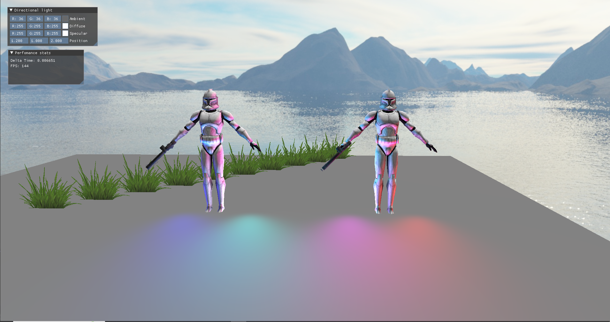
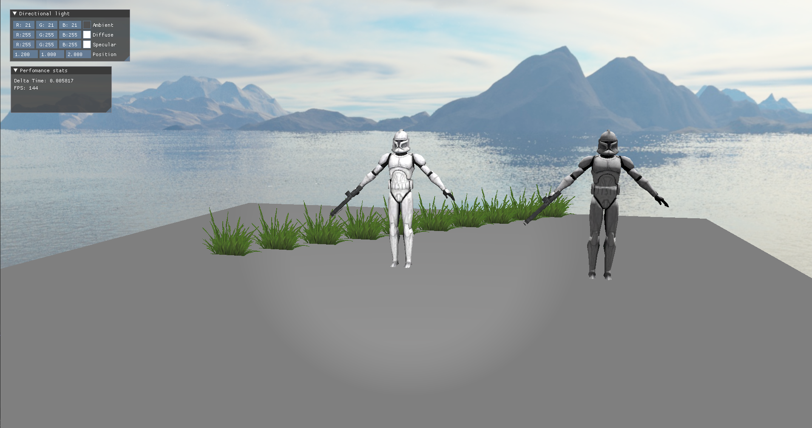

# OpenGL_Renderer

## Introduction
Simple OpenGL renderer where I am learning computer graphics concepts.

<picture>
  <source media="(prefers-color-scheme: dark)" srcset="Pic/GL_PL.png">
  
</picture>

<picture>
  <source media="(prefers-color-scheme: dark)" srcset="Pic/GL.png">
  
</picture>
